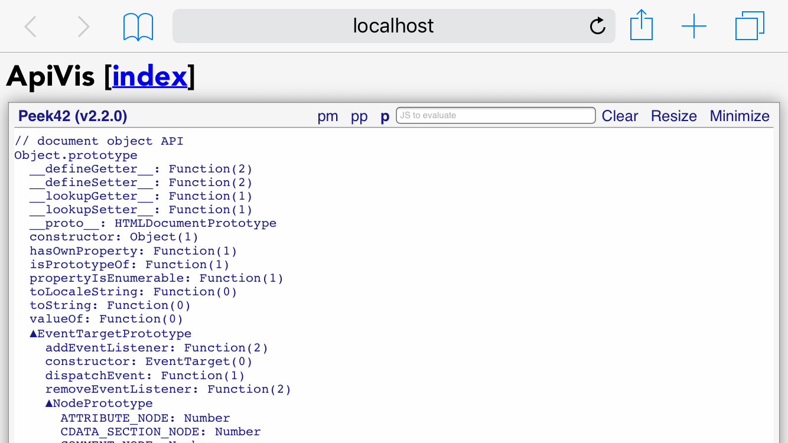

# ApiVis

JavaScript objects API visualization



## [Demo](https://rpeev.github.io/apivis/)

## Distribution

### Unpkg - [https://unpkg.com/apivis@latest/dist/](https://unpkg.com/apivis@latest/dist/)

- Node module (CJS) - [https://unpkg.com/apivis@latest/dist/apivis.node.js](https://unpkg.com/apivis@latest/dist/apivis.node.js)
- Browser bundle (UMD) - [https://unpkg.com/apivis@latest/dist/apivis.browser.js](https://unpkg.com/apivis@latest/dist/apivis.browser.js)
- Universal ES module - [https://unpkg.com/apivis@latest/dist/apivis.universal.mjs](https://unpkg.com/apivis@latest/dist/apivis.universal.mjs)

## Install

### Node

```bash
npm install apivis
```

All distribution files are in `node_modules/apivis/dist/`

### Browser

```html
<script src="https://unpkg.com/apivis@latest/dist/apivis.browser.js"></script>
```

## Use

### Node

```javascript
const apivis = require('apivis');
  const {apiStr} = apivis;

console.log(apiStr(process));
```

### Browser

```javascript
const {apiStr} = apivis;

document.addEventListener('DOMContentLoaded', () => {
  console.log(apiStr(document));
});
```

### ES module

```javascript
import apivis, {apiStr} from 'apivis/dist/apivis.universal'; // Node
import apivis, {apiStr} from 'apivis'; // Bundlers

// Use the imports
```

## API

The following properties/functions are available through the **apivis** namespace object returned from `require('apivis')` on node or available as `window.apivis` in the browser (the ES module has the namespace object as default export and all the functions as named exports):

- `version` - library version
- `typeStr(val)` - returns type string for `val` (based on `Object.prototype.toString.call(val)` with a few twists)
- `descStr(val, k)` - returns own property descriptor string for `k` in `val` in the form `vw ec` or `g c` for example, where each letter shows if the prop is value and writable or getter and setter and if it is enumerable and configurable
- `members(val)` - returns (sorted) array of all *own* `val` property names (including symbols)
- `membersStr(val, indent = '  ', level = 0)` - returns string representation of all *own* `val` property names (including symbols) with type and own property descriptor information and the values of the primitive booleans, numbers and strings, separated by a newline and indented accordingly
- `chain(val)` - returns the prototype chain of `val` (an array, `val` is first, the root is last)
- `chainStr(val, indent = '  ')` - returns string representation of `val` prototype chain
- `apiStr(val, indent = '  ')` - returns string representation of `val` API tree

See the **example** folder for node and browser examples respectively
