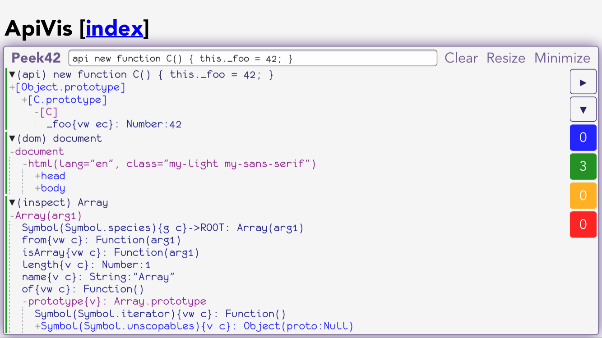

# ApiVis

JavaScript objects API visualization



## [Demos](https://rpeev.github.io/apivis/)

## Install

### Node.js (contains ES module for use with browser bundlers)

```bash
npm install apivis
```

### Script tag

```html
<script src="https://unpkg.com/apivis@latest/dist/apivis.umd.js"></script>
```

## Use

The following properties/functions are available through the **apivis** namespace object returned from `require('apivis')` on **node** or available as `window.apivis` in the browser (the ES module has the namespace object as default export and all the functions as named exports):

- `version` - library version

- `typeStr(obj)` - returns type string for `obj` (based on `Object.prototype.toString.call(obj)` with a few twists)

- `descStr(obj, k)` - returns own property descriptor string for `k` in `obj` in the form `vw ec` or `g c` for example, where each letter shows if the prop is value and writable or getter and setter and if it is enumerable and configurable

- `members(obj)` - returns (sorted) array of all *own* `obj` property names (including symbols)

- `membersStr(obj, indent = '  ', level = 0)` - returns string representation of all *own* `obj` property names (including symbols) with type and own property descriptor information and the values of the primitive booleans, numbers and strings, separated by a newline and indented accordingly

- `chain(obj)` - returns the prototype chain of `obj` (an array, `obj` is first, the root is last)

- `chainStr(obj, indent = '  ')` - returns string representation of `obj` prototype chain

- `apiStr(obj, indent = '  ')` - returns string representation of `obj` API tree

See **example** folder for node and browser examples respectively
